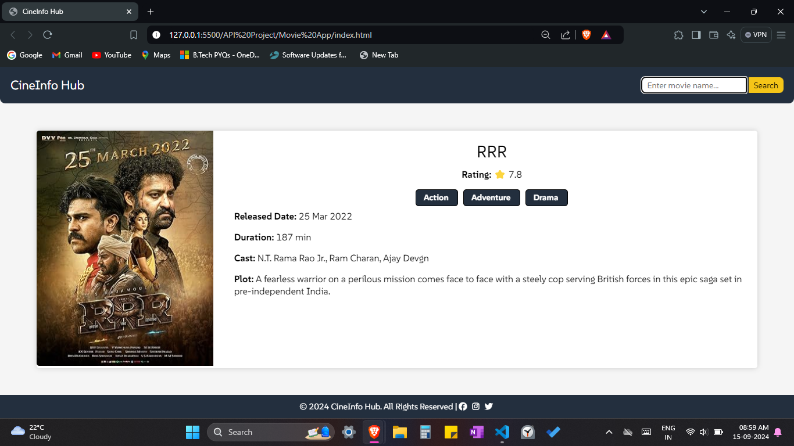

# CineInfo Hub

CineInfo Hub is a web application that allows users to search for movie details by fetching data from the OMDB (Open Movie Database) API. The application provides information such as the movie's title, IMDb rating, genre, release date, duration, cast, and plot summary. The app offers an interactive interface for easy movie exploration.

## Features

- User-friendly interface to search for movies.
- Displays detailed movie information including poster, rating, genre, and more.
- Responsive design for an optimized experience across devices.
- Fetches movie data using the OMDB API.

## Demo



## Technologies Used

- **HTML**: Structuring the content of the application.
- **CSS**: Styling the components and making the app responsive.
- **JavaScript**: Adding functionality to fetch and display movie data.
- **OMDB API**: Used for fetching movie details.

## Installation and Setup

1. Clone the repository:

    ```bash
    git clone https://github.com/VivekSinghSajwan/CineInfo-Hub.git
    ```

2. Navigate to the project directory:

    ```bash
    cd CineInfo-Hub
    ```

3. Open `index.html` in your browser to run the application locally.

## Usage

- Enter the movie name in the search bar and click the **Search** button to fetch details of the movie.
- If a valid movie is found, its details including the poster, rating, genre, release date, and more will be displayed.

## API Reference

The project uses the OMDB API to fetch movie information. You can obtain your API key by signing up on the [OMDB website](http://www.omdbapi.com/apikey.aspx).

Replace the `key` variable in the `script.js` file with your OMDB API key:

```javascript
const key = 'your_api_key_here';
